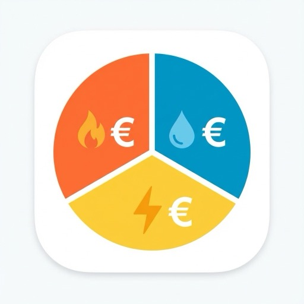

# ioBroker.utility-monitor

[](https://www.npmjs.com/package/iobroker.utility-monitor)
[](https://github.com/fischi87/ioBroker.utility-monitor/releases)
[](https://github.com/fischi87/ioBroker.utility-monitor/blob/main/LICENSE)
[](https://github.com/fischi87/ioBroker.utility-monitor/actions)

## Utility Monitor Adapter for ioBroker

Monitor gas, water, and electricity consumption with automatic cost calculation, advance payment monitoring, and detailed statistics.

### ✨ Hauptfunktionen

- 📊 **Verbrauchsüberwachung** für Gas, Wasser, Strom und **PV/Einspeisung**
- 🎯 **Multi-Meter Support** - Mehrere Zähler pro Typ (z.B. Hauptzähler + Werkstatt)
- 💰 **Automatische Kostenberechnung** mit Arbeitspreis und Grundgebühr
- ☀️ **PV & Einspeisung** - Überwache deine Einspeisung und Vergütung
- 💳 **Abschlagsüberwachung** - Sehe sofort ob Nachzahlung oder Guthaben droht
- 🔄 **Flexible Sensoren** - Nutzt vorhandene Sensoren (Shelly, Tasmota, Homematic, etc.)
- ⚡ **HT/NT-Tarife** - Volle Unterstützung für Hoch- und Nebentarife (Tag/Nacht)
- 🔄 **Gas-Spezial** - Automatische Umrechnung von m³ in kWh
- 🕛 **Automatische Resets** - Täglich, wöchentlich, monatlich und jährlich (Vertragsjubiläum)
- 🔔 **Intelligente Benachrichtigungen** - Getrennte Erinnerungen für Abrechnungsende (Zählerstand) und Vertragswechsel (Tarif-Check) mit einstellbaren Vorlaufzeiten
- � **Wöchentliche Auswertung** _(NEU in 1.5.0)_ - Verfolge deinen Verbrauch auch auf Wochenbasis
- �📥 **CSV Import** _(NEU in 1.5.0)_ - Importiere historische Zählerstände einfach per Drag-and-Drop
- ⌨️ **Komma-Support** - Admin UI akzeptiert `12,50` oder `12.50` für Dezimalzahlen

---

## 💝 Support

Gefällt dir dieser Adapter? Du kannst mich gerne mit einem Kaffee unterstützen! ☕

[](https://paypal.me/bigplay87)

---

## 🚀 Schnellstart

### 1. Installation

1. Adapter über die ioBroker Admin-Oberfläche installieren
2. Instanz erstellen
3. Konfiguration öffnen

### 2. Grundkonfiguration (Beispiel: Gas)

1. ✅ **Gas-Überwachung aktivieren**
2. 🔍 **Sensor auswählen** - Deinen Gaszähler-Sensor (in m³)
3. 📝 **Zählerstand bei Vertragsbeginn** - z.B. 10250 m³ (für korrekte Jahresberechnung)
4. 📅 **Vertragsbeginn** - z.B. 01.01.2026 (für korrekten Jahresreset und Abschlagsberechnung)
5. 🔧 **Offset** _(optional)_ - Falls dein Hardware-Zähler nicht bei 0 startet
6. 🔥 **Brennwert & Z-Zahl** - Von deiner Gasrechnung (z.B. 11,5 und 0,95)
7. 💶 **Preise eintragen**:
    - Arbeitspreis: 0,1835 €/kWh
    - Grundgebühr: 15,03 €/Monat
    - Jahresgebühr: 60,00 €/Jahr (z.B. Zählermiete)
8. 💳 **Abschlag** - Monatliche Vorauszahlung (z.B. 150 €)

**Fertig!** Der Adapter berechnet nun automatisch alle Kosten! 🎉

---

## ⚠️ Breaking Changes in Version 1.4.6

**WICHTIG:** Version 1.4.6 ändert die State-Struktur grundlegend!

### Was hat sich geändert?

**Vorher (bis 1.4.5):**

```
gas.consumption.daily
gas.costs.monthly
wasser.consumption.daily
```

**Jetzt (ab 1.4.6):**

```
gas.main.consumption.daily          ← Hauptzähler mit Namen "main"
gas.main.costs.monthly
wasser.main.consumption.daily
```

### 🔧 Migration erforderlich

1. **Config öffnen**: Neue Felder "Name des Hauptzählers" für Gas/Wasser/Strom/PV
2. **Namen eingeben**: Standard ist "main" (empfohlen), oder eigener Name wie "wohnung", "haus"
3. **Skripte anpassen**: Alle Verweise auf States müssen angepasst werden

    ```javascript
    // Alt:
    getState('utility-monitor.0.gas.consumption.daily');

    // Neu:
    getState('utility-monitor.0.gas.main.consumption.daily');
    ```

4. **Visualisierungen updaten**: VIS, Grafana, etc. auf neue Pfade anpassen

### 💡 Warum diese Änderung?

- **Konsistenz**: Alle Zähler (Haupt + Zusätzlich) verwenden jetzt die gleiche Struktur
- **Flexibilität**: Hauptzähler kann jetzt frei benannt werden (z.B. "erdgeschoss", "gesamt")
- **Klarheit**: Keine Special-Case Logik mehr im Code
- **Multi-Meter**: Bessere Unterstützung für mehrere Zähler pro Typ
- **CSV Import**: Einfaches Nachpflegen von historischen Daten via Drag-and-Drop im Admin-Interface

---

## 📥 CSV Import (v1.5.0)

Der neue Import-Tab ermöglicht es dir, historische Zählerstände bequem hochzuladen.

### Unterstützte Formate

- **Generic CSV**: Datum (DD.MM.YYYY), Zählerstand
- **EhB+ App**: Direkter Import aus der EhB+ App möglich

### So funktioniert's

1. Gehe zum Tab **Import**
2. Wähle den **Zählertyp** (Gas/Wasser/Strom) und den **Zähler** aus
3. Ziehe deine CSV-Datei in das Upload-Feld
4. Klicke auf **Daten importieren**

---

## 📊 Datenpunkte erklärt

Für jede aktivierte Verbrauchsart (Gas/Wasser/Strom/PV) werden folgende Ordner angelegt:

**Wichtig:** Seit Version 1.4.6 beinhalten alle Pfade den Zähler-Namen (z.B. `gas.main.*` statt `gas.*`)

### 🗂️ **consumption** (Verbrauch)

| Datenpunkt      | Beschreibung                                          | Beispiel         |
| --------------- | ----------------------------------------------------- | ---------------- |
| `daily`         | Verbrauch **heute** (seit 00:00 Uhr)                  | 12,02 kWh        |
| `dailyVolume`   | Verbrauch heute in m³                                 | 1,092 m³         |
| `weekly`        | Verbrauch **diese Woche** (seit Montag)               | 84,12 kWh        |
| `weeklyVolume`  | Wöchentlicher Verbrauch in m³                         | 7,65 m³          |
| `monthly`       | Verbrauch **diesen Monat** (seit 1. des Monats)       | 117,77 kWh       |
| `monthlyVolume` | Monatlicher Verbrauch in m³                           | 10,69 m³         |
| `yearly`        | Verbrauch **seit Vertragsbeginn** (this billing year) | 730,01 kWh       |
| `yearlyVolume`  | Jahresverbrauch in m³                                 | 66,82 m³         |
| `dailyHT`       | Tagesverbrauch im **Haupttarif** (HT)                 | 8,40 kWh         |
| `dailyNT`       | Tagesverbrauch im **Nebentarif** (NT)                 | 3,62 kWh         |
| `weeklyHT`      | Wochenverbrauch im HT                                 | 58,15 kWh        |
| `weeklyNT`      | Wochenverbrauch im NT                                 | 25,62 kWh        |
| `monthlyHT`     | Monatsverbrauch im HT                                 | 82,15 kWh        |
| `monthlyNT`     | Monatsverbrauch im NT                                 | 35,62 kWh        |
| `yearlyHT`      | Jahresverbrauch im HT                                 | 511,00 kWh       |
| `yearlyNT`      | Jahresverbrauch im NT                                 | 219,01 kWh       |
| `lastUpdate`    | Letzte Aktualisierung                                 | 06.01.2026 14:11 |

**💡 Tipp:** `yearly` wird automatisch als `(Aktueller Zählerstand - Offset) - Initial Reading` berechnet!

**📅 Wichtig:** Der Jahresreset erfolgt am **Vertragsbeginn-Datum** (z.B. 12. Mai), NICHT am 1. Januar!

---

### 💰 **costs** (Kosten)

| Datenpunkt    | Was ist das?                                                  | Berechnung                            | Beispiel                       |
| ------------- | ------------------------------------------------------------- | ------------------------------------- | ------------------------------ |
| `daily`       | Kosten **heute**                                              | daily × Arbeitspreis                  | 2,27 €                         |
| `monthly`     | Kosten **diesen Monat**                                       | monthly × Arbeitspreis                | 21,61 €                        |
| `yearly`      | **Verbrauchskosten** seit Vertragsbeginn                      | yearly × Arbeitspreis                 | 137,61 €                       |
| `totalYearly` | **Gesamtkosten Jahr** (Verbrauch + alle Fixkosten)            | yearly-cost + basicCharge + annualFee | 212,64 €                       |
| `basicCharge` | **Grundgebühr akkumuliert**                                   | Grundgebühr × Monate                  | 15,03 €                        |
| `annualFee`   | **Jahresgebühr** (fester Wert pro Jahr)                       | Jahresgebühr (aus Config)             | 60,00 €                        |
| `paidTotal`   | **Bezahlt** via Abschlag                                      | Abschlag × Monate                     | 150,00 €                       |
| `balance`     | **🎯 WICHTIGSTER Wert!**<br>Nachzahlung (+) oder Guthaben (-) | totalYearly - paidTotal               | **+62,64 €**<br>→ Nachzahlung! |

#### 🔍 **balance** genauer erklärt:

- **Positiv (+50 €)** → ❌ **Nachzahlung**: Du musst am Jahresende zahlen
- **Negativ (-24 €)** → ✅ **Guthaben**: Du bekommst Geld zurück
- **Null (0 €)** → ⚖️ **Ausgeglichen**: Verbrauch = Abschlag

**Beispiel:**

```
Verbrauchskosten:  137,61 € (yearly)
Grundgebühr:      + 15,03 € (basicCharge - 1 Monat × 15,03€)
Jahresgebühr:     + 60,00 € (annualFee - fester Wert)
────────────────────────────
Gesamtkosten:      212,64 € (totalYearly)

Bezahlt (Abschlag): 150,00 € (paidTotal - 1 Monat × 150€)
────────────────────────────
Balance:           +62,64 € → Nachzahlung
```

---

### ℹ️ **info** (Informationen)

| Datenpunkt           | Beschreibung                 | Beispiel         |
| -------------------- | ---------------------------- | ---------------- |
| `currentPrice`       | Aktueller Arbeitspreis       | 0,1885 €/kWh     |
| `meterReading`       | Zählerstand in kWh           | 112711,26 kWh    |
| `meterReadingVolume` | Zählerstand in m³ (nur Gas)  | 10305,03 m³      |
| `lastSync`           | Letzte Sensor-Aktualisierung | 06.01.2026 14:11 |
| `sensorActive`       | Sensor verbunden?            | ✅ true          |

---

### 📈 **statistics** (Statistiken)

| Datenpunkt       | Beschreibung                         |
| ---------------- | ------------------------------------ |
| `averageDaily`   | Durchschnittlicher Tagesverbrauch    |
| `averageMonthly` | Durchschnittlicher Monatsverbrauch   |
| `lastDay`        | Verbrauch **gesten** (Vortag)        |
| `lastWeek`       | Verbrauch **letzte Woche**           |
| `lastMonth`      | Verbrauch **letzter Monat**          |
| `lastDayStart`   | Letzter Tages-Reset (00:00 Uhr)      |
| `lastWeekStart`  | Letzter Wochen-Reset (Montag)        |
| `lastMonthStart` | Letzter Monats-Reset (1. des Monats) |
| `lastYearStart`  | Vertragsbeginn / Jahresstart         |

---

### 📅 **billing** (Abrechnungszeitraum)

| Datenpunkt          | Beschreibung                             | Beispiel    |
| ------------------- | ---------------------------------------- | ----------- |
| `endReading`        | Endzählerstand (manuell eintragen)       | 10316.82 m³ |
| `closePeriod`       | Zeitraum jetzt abschließen (Button)      | true/false  |
| `periodEnd`         | Abrechnungszeitraum endet am             | 01.01.2027  |
| `daysRemaining`     | Tage bis Abrechnungsende                 | 359 Tage    |
| `newInitialReading` | Neuer Startwert (für Config übernehmen!) | 10316.82 m³ |

**💡 Workflow am Jahresende:**

1. Physischen Zähler ablesen (z.B. 10316.82 m³)
2. Wert in `endReading` eintragen
3. `closePeriod` auf `true` setzen
4. ✅ Adapter archiviert automatisch alle Daten in `history.{JAHR}.*`
5. ⚠️ **Wichtig:** Config aktualisieren mit neuem `initialReading` (siehe `newInitialReading`)

---

### 📊 **history** (Jahres-Historie)

| Datenpunkt                  | Beschreibung                            | Beispiel   |
| --------------------------- | --------------------------------------- | ---------- |
| `history.2024.yearly`       | Jahresverbrauch 2024                    | 730.01 kWh |
| `history.2024.yearlyVolume` | Jahresverbrauch 2024 in m³ (Gas/Wasser) | 66.82 m³   |
| `history.2024.totalYearly`  | Gesamtkosten 2024                       | 162.64 €   |
| `history.2024.balance`      | Bilanz 2024 (Nachzahlung/Guthaben)      | +12.64 €   |

**💡 Automatische Archivierung:**

- Wird beim Abschluss des Abrechnungszeitraums erstellt
- Speichert alle wichtigen Jahreshöchstwerte inkl. HT/NT
- Ermöglicht Jahresvergleiche

---

### 🔧 **adjustment** (Manuelle Anpassung)

Korrigiere Sensor-Abdrift durch manuelle Anpassung.

| Datenpunkt | Beschreibung                         | Beispiel  |
| ---------- | ------------------------------------ | --------- |
| `value`    | Korrekturwert (Differenz zum Zähler) | +4.2 m³   |
| `note`     | Notiz/Grund für Anpassung (optional) | "Ausfall" |
| `applied`  | Zeitstempel der letzten Anwendung    | 17035...  |

**💡 Workflow:**

1. Physischen Zähler ablesen: **10350 m³**
2. Adapter zeigt: **10346 m³**
3. Differenz in `adjustment.value` eintragen: **+4**
4. ✅ Alle Berechnungen werden automatisch korrigiert.
5. **Dank der HT/NT-Integration** werden Anpassungen bei HT/NT-Tarifen automatisch dem Haupttarif (HT) angerechnet.

---

## ⚙️ Spezialfunktionen

### ⚡ Gas: m³ → kWh Umrechnung

Gasverbrauch wird in **m³ gemessen**, aber in **kWh abgerechnet**.

**Formel:** `kWh = m³ × Brennwert × Z-Zahl`

💡 **Tipp:** Brennwert und Z-Zahl findest du auf deiner Gasrechnung!

### 🔄 Automatische Resets

Der Adapter setzt Zähler automatisch zurück:

| Zeitpunkt             | Was passiert  | Beispiel            |
| --------------------- | ------------- | ------------------- |
| **23:59 Uhr** täglich | `daily` → 0   | Neuer Tag beginnt   |
| **Sonntag 23:59**     | `weekly` → 0  | Neue Woche beginnt  |
| **Monatsende 23:59**  | `monthly` → 0 | Neuer Monat beginnt |
| **Vertragsjubiläum**  | `yearly` → 0  | Abrechnungsjahr neu |

---

## Changelog

### 1.5.0 (2026-01-23)

- **NEU:** 📥 **CSV Import** - Importiere historische Zählerstände einfach per Drag-and-Drop:
    - Neuer "Import"-Tab in der Konfiguration
    - Modulare Backend-Struktur für CSV-Parsing
    - Unterstützung für generische und EhB+-Formate
    - Moderne React-basierte UI-Komponente für eine flüssige Bedienung
- **NEU:** 📊 **Wöchentliches Tracking** - Verbrauchsüberwachung nun auch auf Wochenbasis möglich
- **FIX:** 🕛 **Reset-Timing** - Automatische Resets werden nun um 23:59 Uhr ausgeführt (statt 00:00 Uhr), um Datenverluste am Ende des Zeitraums zu vermeiden
- **ARCHITEKTUR:** 🏗️ **Verbesserte Backend-Modularisierung**:
    - `ImportManager` eingeführt, um die Logik von `main.js` zu trennen

### 1.4.6 (2026-01-20)

- **⚠️ BREAKING CHANGE:** 🔄 **Hauptzähler-Benennung** - Hauptzähler benötigt jetzt einen Namen:
    - **State-Pfade geändert**: `gas.*` → `gas.METER_NAME.*` (z.B. `gas.main.*`)
    - **Neue Config-Felder**: "Name des Hauptzählers" für Gas/Wasser/Strom/PV
    - **Default-Name**: "main" (wird automatisch verwendet wenn leer gelassen)
    - **Konsistente Struktur**: Alle Zähler (Haupt + Zusätzlich) verwenden jetzt `type.meterName.*`
    - **Flexibilität**: Hauptzähler kann jetzt frei benannt werden (z.B. "wohnung", "erdgeschoss", "gesamt")
    - **Keine Special-Cases**: Vereinfachte Logik im Code
- **NEU:** 🔔 **Smart Notifications** - Zählerauswahl für Benachrichtigungen:
    - Wähle pro Utility-Typ aus, welche Zähler benachrichtigt werden sollen
    - Multi-Select Dropdown zeigt alle konfigurierten Zähler
    - Wenn leer: Alle Zähler werden benachrichtigt (Standard)
    - Wenn ausgewählt: Nur gewählte Zähler erhalten Benachrichtigungen
    - Gilt für Abrechnungsende, Vertragswechsel und monatliche Berichte
- **VERBESSERT:** 🏗️ **Code-Architektur** - Entfernung von 19 Special-Case Checks in 7 Dateien:
    - Vereinfachte basePath-Berechnungen in multiMeterManager, billingManager, stateManager
    - Vereinheitlichter Config-Zugriff (alle Meter nutzen `meter.config.contractStart`)
    - HT/NT-Logik basiert jetzt auf `config.htNtEnabled` statt Meter-Name
    - Button-Trigger erkennt nur noch einheitliche Pfadstruktur
    - Legacy-Code entfernt: updateBillingCountdown, updateCurrentPrice jetzt pro Zähler
- **MIGRATION:** 📋 **Upgrade-Hinweise**:
    - Bei Neuinstallation: Namen für Hauptzähler eingeben (oder "main" akzeptieren)
    - Bei Upgrade: Adapter neu konfigurieren + Skripte/Visualisierungen anpassen
    - History: Alte States bleiben erhalten, neue States werden parallel erstellt
    - Empfehlung: "main" als Namen verwenden für einfachere Migration

### 1.4.5 (2026-01-20)

- **FIX:** 🐛 **Kritische Multi-Meter Kostenberechnungsfehler** - Umfassende Korrekturen für Multi-Meter Funktionalität:
    - **Hauptzähler Sync-Problem**: Doppelte Initialisierung entfernt, die `lastSync` Updates verhinderte
    - **basicCharge Akkumulation**: Berechnet jetzt korrekt `basicCharge = Grundgebühr × Monate` (vorher nur 1 Monat)
    - **paidTotal Akkumulation**: Berechnet jetzt korrekt `paidTotal = Abschlag × Monate` (vorher nur 1 Monat)
    - **Jahresgebühr als fester Wert**: Jahresgebühr wird jetzt als fester jährlicher Wert genutzt (z.B. 60€ bleibt 60€)
        - Vorher fälschlicherweise als monatlich behandelt
        - Eingegebener Wert wird nun direkt wie vorgesehen genutzt
    - **Balance-Formel korrigiert**: Formel `balance = totalYearly - paidTotal` korrigiert
        - Positive Balance = Nachzahlung (Schuldner)
        - Negative Balance = Guthaben (Rückerstattung)
- **VERBESSERT:** 📦 **Entwickler-Abhängigkeiten**: Umstellung von Tilde (~) auf Caret (^) Versionierung für bessere Sicherheitsupdates
- **CLEANUP:** 🧹 **Repository Compliance**: Unveröffentlichte Versionen aus dem Changelog entfernt (löst ioBroker Bot Issue #1)

### 1.4.2 (2026-01-18)

- **FIX:** 🔧 **TypeScript Fehler behoben** - Alle Kompilierungsfehler behoben:
    - `formatDateString()` fehlendes Argument im multiMeterManager korrigiert
    - Datums-Arithmetik Typfehler behoben
    - `@ts-ignore` Kommentare für absichtliche Fehlertests hinzugefügt
- **FIX:** 🐛 **Kritischer Multi-Meter Balance-Bug** - Korrektur fehlerhafter Bilanzberechnung:
    - `totalYearly` nutzte hartcodierte 12 Monate für die Grundgebühr statt der tatsächlichen Monate seit Vertragsstart
    - Berechnet nun korrekt `basicChargeAccumulated = Grundgebühr × MonateSeitJahresstart`
- **NEU:** ✅ **Erweiterte Eingabevalidierung** - Robuste Validierung von Konfigurationswerten:
    - `isValidSensorDP()` - Validiert Sensor-Datenpunkt-IDs
    - `parseConfigDate()` - Validiert deutsche und ISO Datumsformate
    - `parseConfigPrice()` - Stellt sicher, dass Preise nicht negativ sind
- **NEU:** 📋 **Zentrale Konstanten** - Zentralisierte Konstantendefinitionen:
    - Rundungspräzision, Zeitkonstanten, Validierungsregeln
- **NEU:** 🛡️ **Fehlerbehandlung** - Sicherer Wrapper für State-Erstellung:
    - `safeSetObjectNotExists()` fängt Fehler bei der State-Erstellung ab
- **VERBESSERT:** 🧪 **Code-Qualität** - Alle Tests erfolgreich (31 Unit + 57 Paket-Tests)

---

## License

MIT License

Copyright (c) 2026 fischi87 <axel.fischer@hotmail.com>
